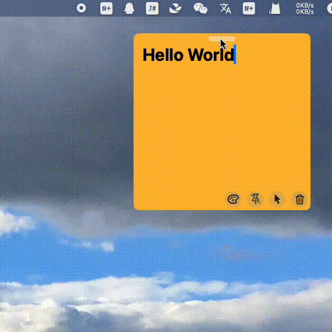

# WinDragger
A swiftUI view, you can drag window with this view.

## Install
In your macOS project, **File** -> **Add Package Dependencies ...**, search `https://github.com/boybeak/WinDragger.git`

## Usage
```swift
WinDraggerView()
    .onDragStart {
        self.isDragging = true
        noteVM.uiCallback?.actionOnDragStart()
        NSCursor.closedHand.set()
    }
    .onDragEnd {
        self.isDragging = false
        noteVM.uiCallback?.actionOnDragEnd()
        NSCursor.openHand.set()
    }
    .background {
        RoundedRectangle(cornerSize: CGSize(width: 8, height: 8))
            .fill(draggerColor)
            .stroke(barColor, lineWidth: 1)
    }
    .padding(.top, 0)
    .frame(width: 40, height: 8)
    .offset(y: 4)
    .transition(.opacity)
    .onHover { hovering in
        if hovering {
            NSCursor.openHand.set()
        } else {
            NSCursor.arrow.set()
        }
    }
```

